# Lab04-Extending-Teams-lab-instructions

# Exercise 1: Collecting user input with task modules

## Task 1: Create Microsoft Teams app

Test the personal tab

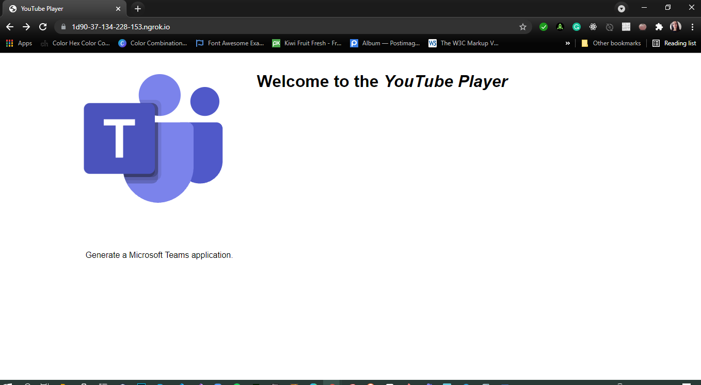

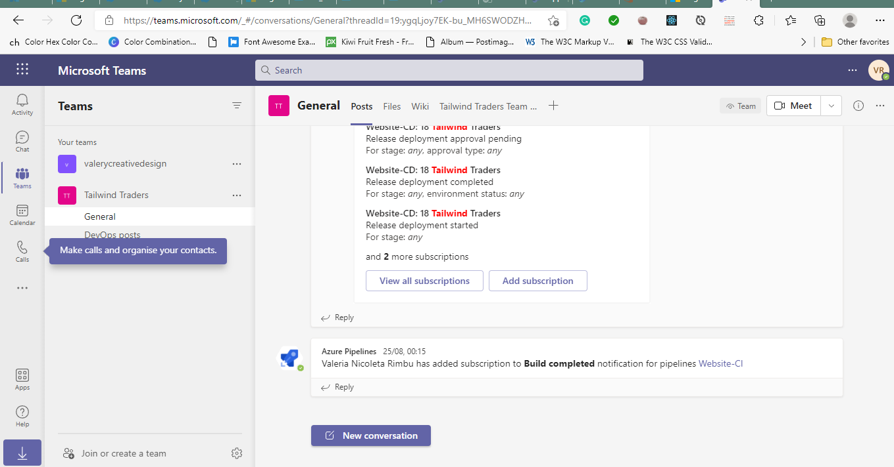

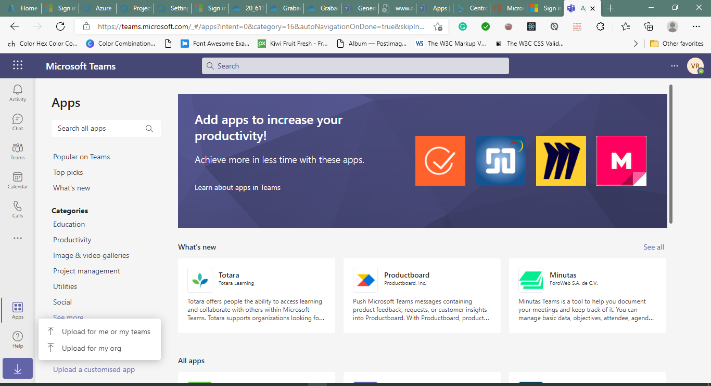

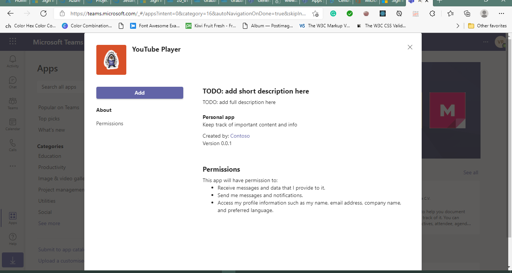

Implement the personal tab's user interface

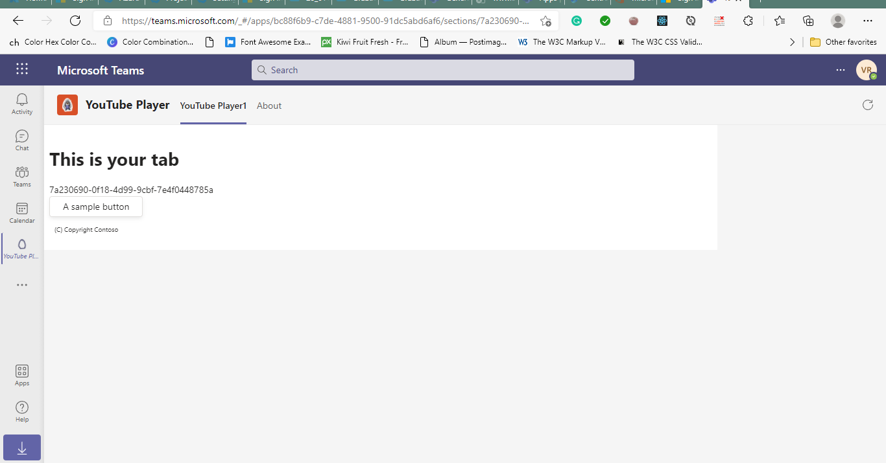

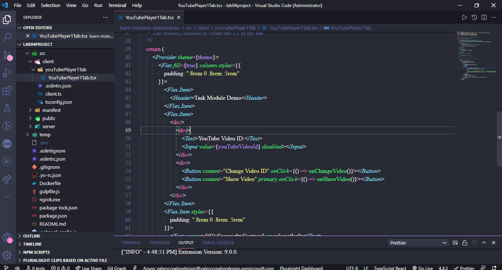

Test the personal tab

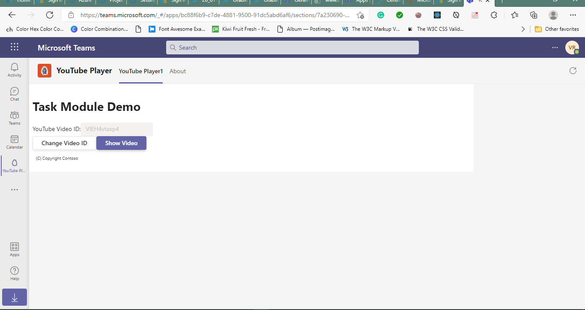

## Task 2: Add video player task module

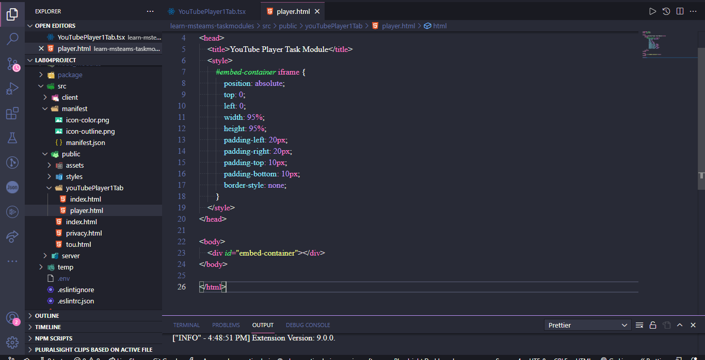

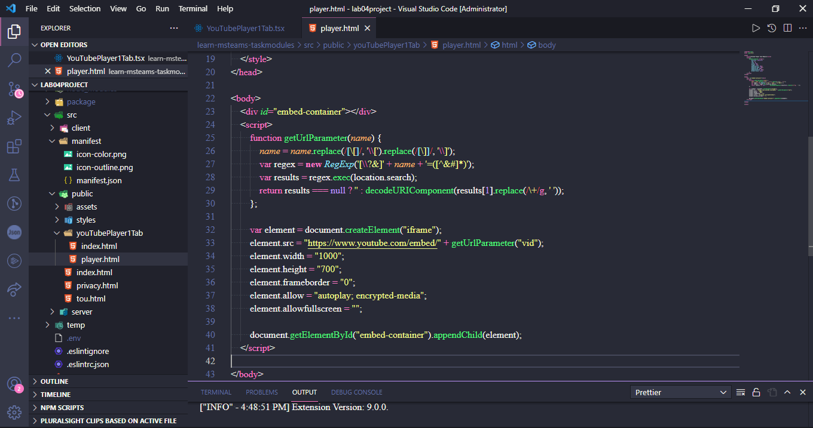

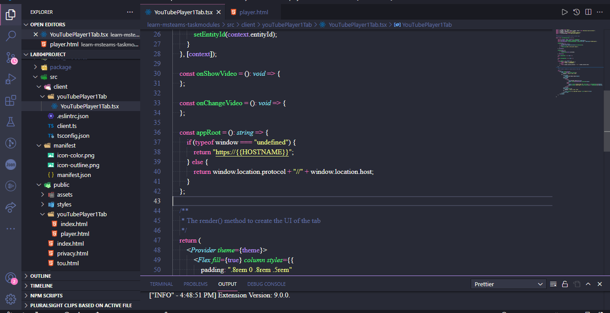

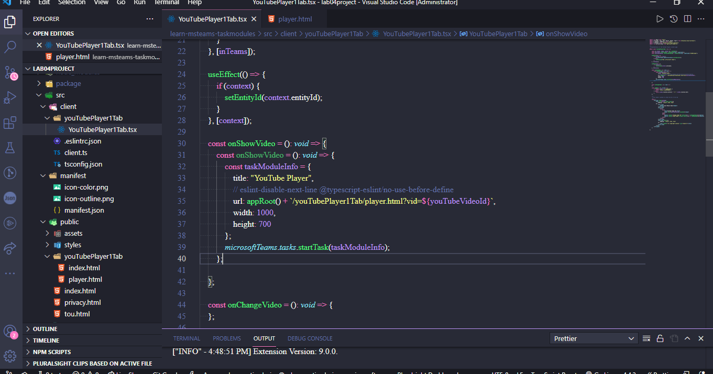

Test the video player task module

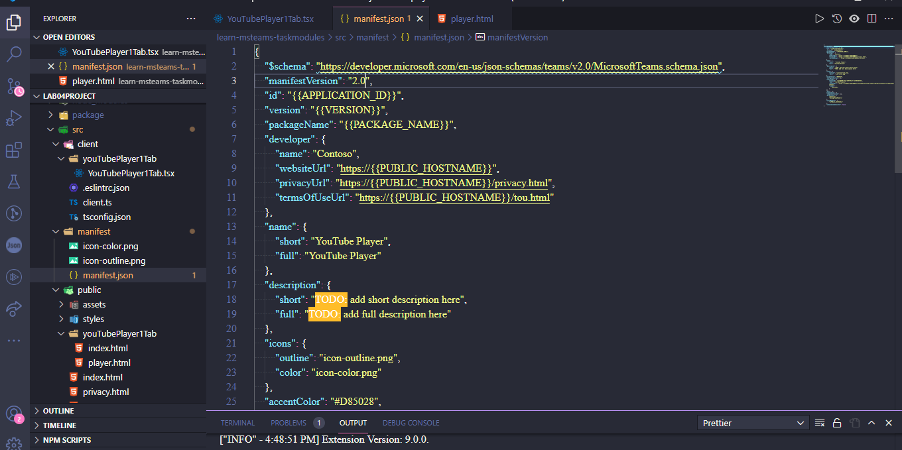