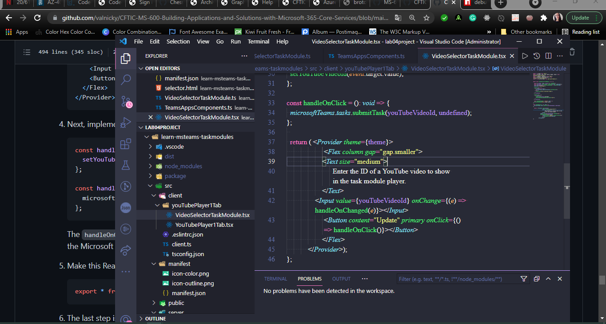
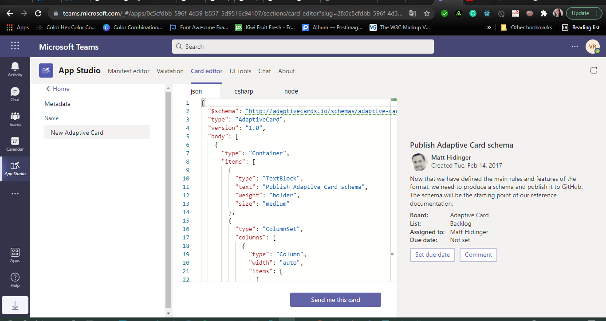
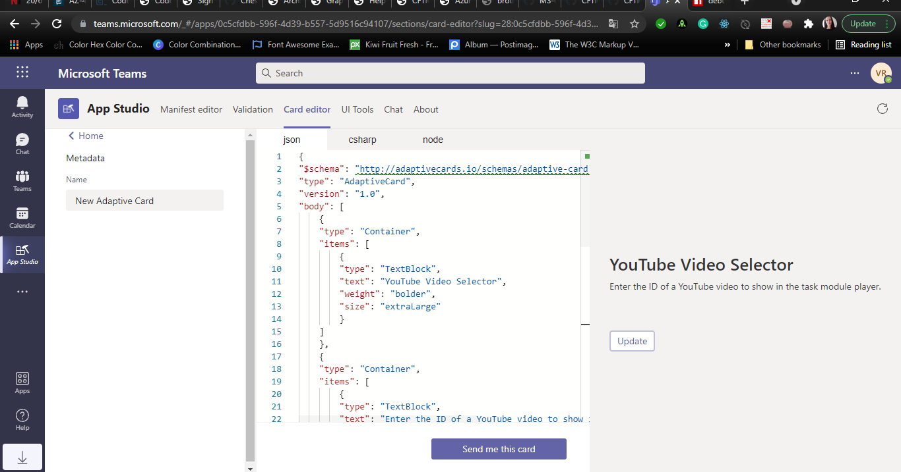
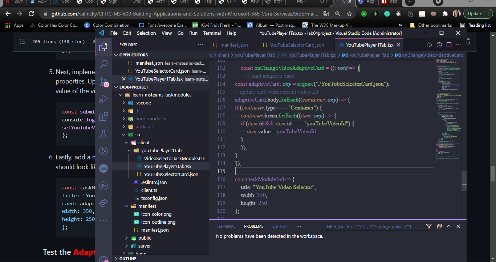

# Lab04-Extending-Teams-lab-instructions

# Exercise 1: Collecting user input with task modules

## Task 1: Create Microsoft Teams app

Test the personal tab

Implement the personal tab's user interface

Test the personal tab

## Task 2: Add video player task module

Test the video player task module

************************************************************
**********************************
************************

## Task 3: Add video selector task module

Create the task module's React app web page host

Register the new page

Implement the React app for the selector task module

Test the video selector task 

# Exercise 2: Using adaptive cards and deep links in task modules

## Task 1: Create video selector as an adaptive card

## Task 2: Create a new task module that uses the Adaptive Card

Test the Adaptive Card task module

